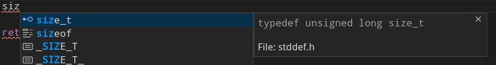
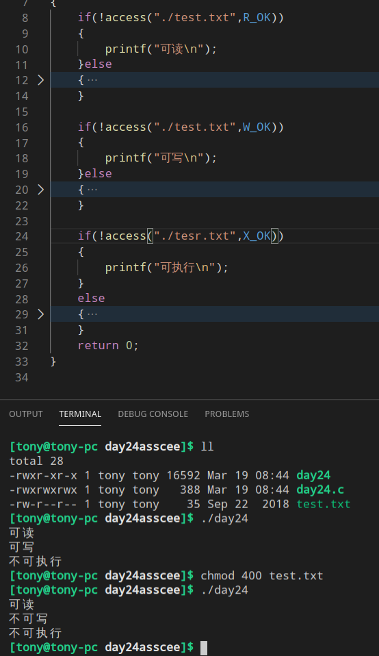
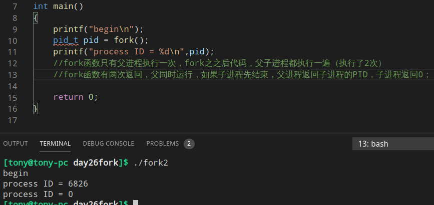

# 达学网校Linux+C语言课程

## 一、Linux操作系统学习材料
[在线视频](https://www.bilibili.com/video/av69981906?p=1)

## 二、Linux C语言学习
[在线视频](https://www.bilibili.com/video/av69981906?p=31)

### 1.%hhd——输出ASCII码
```c
int main(int argc, char *argv[]){
    char c = 97;
    printf("ASCII 97 = %c\n", c);
    printf("ASCII 97 = %hhd\n", c);

    return 0;
}

[tony@tony-pc 10.binary_system]$ ./test 
ASCII 97 = a
ASCII 97 = 97
```
如果
```c
char c = 200;
printf("ASCII 200 = %c\n", c);
printf("ASCII 200 = %hhd\n", c);

得到的 %hhd结果是负数，那么两个数的绝对值就是计算机位数，
ASCII 97 = �
ASCII 97 = -56

56+200=256=2^8,所以计算机是 8 位存储字符类型的
```

### 2.%02d——格式化输出 00
```c
printf("The time is %02d:%02d:%02d \n", hour, min, sec);

The time is 01:00:00
```

### 3.[数组形参](2Linux_C语言学习材料/3.code/38.array_parameter/day38.c)
函数形参不能修改函数外的，但是数组是可以的

### 4.文件
#### 1)框架
```c
int main(int argc, char *argv[]){
    FILE *p_file = fopen("/home/tony/Chat_online/Server.java", "w");
    if(!p_file){
        printf("File open fail");
        return 0;
    }
    fclose(p_file);
    p_file = NULL;

    return 0;
} 
```

最重要的是，不要忘了这两句，否则出现野指针。
```c
fclose(p_file);
p_file = NULL;
```

#### 2)文件打开模式
```
r   只能读文件，读操作从文件头开始，文件必须事先存在

r+  在前一个模式的基础上增加修改能力

w   只能修改文件内容，修改操作从文件头开始如果文件事先不存在则创建新文件，如果文事先已经存在则删除原有文件中的内容

w+  在前一个模式的基础上增加读能力

a   只能修改文件内容，如果文件事先不存则创建新文件，如果文件事先已经存在则在源文件的原有内容的基础上追加新内容
	
b   可以和前面任何一种模式混合使用，这模式表示以二进制方式对文件进行操作
```

fread/fwrite用来想文件读写数据
```
四个参数
1、数组（fread会吧文件中得到的内容存放到
数组的存储单位内，fwrite会吧数组中存储位置
的内容写入文件）
2、数组中单个存储位置的大小
3、希望使用存储位置的个数
4、要操作的文件
```

### 5.变量
1、auto用来声明自动变量，所有局部变量都缺省的是自动变量，几乎不需要使用这个关键字

2、static关键字用来声明静态变量  

3、const  常量

4、[volatile关键字](2Linux_C语言学习材料/3.code/45.volatile/day45.c)
volatile关键字用来声明多变变量，这种变量的内容随时可能被改变，而且这种改变的原因不是我们的语句造成的！

volatile关键字告诉编译器i是随时可以发生改变的每次使用他的时候必须从i的地址中读取，因为编译器生成的可执行代码会从i的地址读取数据放在k

而优化的方法就是，由于编译器发现两次从 i 读取数据的代码之间的代码没有对i进行过操作他会自动吧上次读的数据放在k中，而不是从新从i里面读取，这样一来，如果i是一个寄存器变量或者端口数据就容易出错，

volatile关键字有个优点：可以保证对特殊地质的稳定性访问

### 6.[数组如何做到回车停止输入](2Linux_C语言学习材料/3.code/48.use_point/test/test.c)

### 7.随机数
我们计算机所做的随机数都是伪随机

rand标准函数用来获得随机数,使用rand标准函数需要使用stdlib.h头文件

srand标准函数可以用来设置随机数种子
```srand()```
随机种子，吧时间当做随机种子种下即可

time可以用来获取当前时间，得到的时间是一个整数类型

代表的是1970年1月1日0时0分0秒到我们现在此时此刻的时间

### 8.void*类型的指针
这种类型的指针只表示了其中记录了一个地址数据但是没告诉我们可以根据他找到什么类型的存储位置

void型指针通常用来接收来源不明的数据地址

void型指针用来做形参

### 9.地址数据所能参与的四则运算

**只能够+和-，不能乘和除！**加和减也有限制
```
地址 + 整数
地址 - 整数
地址 - 地址
```

以上计算中的整数都是有单位的，单位由地址数据的类型决定

地址数据相减的结果是整数，这个整数也是有单位的，单位由地址数据的类型决定

### 10.[字符串演示](2Linux_C语言学习材料/3.code/56.string_function/day56.c)

### 11.少使用scanf接收字符串——最安全的输入：fget
scanf不能输入带' '的字符串,字符串太长了，scanf越界错误

使用 [fget](2Linux_C语言学习材料/3.code/58.gets/day58.c)

### 12.文件位置指针
文件位置还真用来记录下一次文件操作的开始
位置
这个指针会记录一个整数，这个整数代表这个
位置到文件头的距离
```
ftell标准函数可以得到位置指针的数值
rewind标准函数可以设置位置指针到文件开头
```
fseek标准函数可以吧文件位置指针移动到文件中的任何位置
三个参数
- 1、要操作的文件
- 2、要移动的位置
- 3、下面这三个参数之一
    > SEEK_SET   0文件头作为基准位置
    > SEEK_CUR   1当前位置作为基准位置 
    > SEEK_END   2文件尾作为基准位置 

### 13.宏
使用fget输入[计算圆周率](2Linux_C语言学习材料/3.code/65.macro_compute/test/test.c)

#### 1)宏操作符——[#和##](2Linux_C语言学习材料/3.code/66.macro_operator/day66.c)

#操作符：可以吧宏的一个参数转换成字符串字面值

##操作符：可以吧一个代表标识符的参数和其他内容合并成一个新的标识符


### 14条件编译演示
```
gcc -D
使用gcc编译源文件的时候，加上选项-D，可以定义一个宏
```


## 三、Unix,linux核心编程
[在线视频](https://www.bilibili.com/video/av69981906?p=92)

### 1静态库和共享库——利用 .o 文件
#### 1)[静态库](3Unix,linux核心编程/day02静态链接库/day02.c)
静态链接库就是把代码归档——>完全独立，链接之后就可以删除了
```
$> ar -r <库文件名> *.o

库文件名:
    lib开头+库名+.a
```

链接静态库和.o文件,有三种：
- 1、强行链接：
> gcc .o文件 库名称

- 2、双L链接法（重点）
> gcc .o文件 -l库名 -L库所在目录

- 3、单L链接法
> gcc .o文件 -l库名称(需要配置环境变量)

#### 2)[动态库](3Unix,linux核心编程/day03共享库/day03.c)
就是一个地址链接——>使用的时候，必须存在动态链接库
共享库创建步骤：
- 1、写源程序.c文件
- 2、编写生成.o文件
- 3、生成共享库文件.so

```
gcc -shared .o文件 -o.so共享库文件
```
**一般开发的时候，才有动态链接库**

---
##### 出错
1.```error while loading shared libraries: libtest.so: cannot open shared object file: No such file or directory```：需要配置环境变量

```bash
export LD_LIBRARY_PATH=<动态链接.so所在目录>:$LD_LIBRARY_PATH
```


2.ldd——查看动态链接库

ldd显示```not a dynamic executable```可以使用```readelf -d```


### 2错误处理
#### 1)return 返回值
主流的编程语言（除了C语言）都是用异常机制处理错误

C语言用的是返回值代表出错

几种情况
- 1 如果返回值类型是int，并且返回值不可能是**负数**，数据会正常返回，返回 **-1** 代表出错！
- 2 如果返回类型是int，并且返回值可能是负数返回 **-1**代表出错，**0**代表正确，数据用指针返回到主函数！
- 3 如果返回类型是指针，返回 **NULL**代表出错,其他代表正常（针对指针）
- 4 如果函数不需要考虑出问题，用void做返回值！
> 所有C的错误处理都是采用返回值

#### 2)errno记录错误信息
打印具体信息 （字符类型）
	
##### 错误处理函数
- strerror
> strerror() -> 负责传入一个编号，返回具体信息（不负责打印，只是一个转换函数）

- perror
> perror()   -> 不用传入错误信息，直接打印errno对应信息

- printf
> printf()   -> %m专门给错误使用的，用来打印错误信息， 后面不用传入参数			  

	 
要使用errno这个外部局部变量需要包含头文件```errno.h```

要使用错误处理函数还需要包含```string.h头文件```


### 3.环境变量
每个程序内部都有变量，操作系统也是一个程序，所以操作系统打变量是**环境变量**

环境变量是一些字符串，需要存放到**表**(字符指针， NULL表示结束)里面，这个表就是**环境表**，其中```environ```全局变量保存给数组的首地址。
所以需要
```c
extern char **environ;
char **p=environ;
```

[环境表打印](3Unix,linux核心编程/day06环境表打印/demo/test.c)

环境表变量是标C的函数，他在头文件stdlib.h中，因此要包含头文件stdlib.h

[环境表变量操作函数](3Unix,linux核心编程/day08getenv/day08.c)：
- getenv  ->  返回指向name关联的value的指针（用来获取）
> getenv	->  按环境变量的名取得环境变量的值

- putenv  ->  将形式为name = value的环境变量放入环境表（用来设置）
- setenv  ->  将name设置成value，第三个参数决定是否替代以后的变量
> putenv/setenv<br>
> &emsp;区别：<br>
> &emsp;&emsp;putenv() -> 参数格式：”name = value“<br>
> &emsp;&emsp;setenv() -> 三个参数（分开的）<br>
> &emsp;&emsp;putenv() -> 一定会替换掉已经存在的值<br>
> &emsp;&emsp;setenv() -> 可以用第三个参数决定是否替换,setenv第三个参数，如果是0表示不替换，如果是1表示替换

- unsetenv   ->  删除定义
- clearenv   ->  删除环境表中所有的项

主函数有第三个参数 -> char** env ,```int main(int argc,char** argv,char** env)```			主函数第三个参数（）就是环境表
	 
### 4.Unix/Linux内存管理
Unix/Linux -> 重要，但是有点难度
#### 1)内存的分配和回收的相关函数
```
       |
   STL容器 —> 自动分配和自动回收
       |
   C++语言 -> new分配，delete回收（不是函数）
       |
   C 语言  -> malloc（）  free（）
       |
       |(下面的在windows上用不了)
       |
   unix系统函数 -> sbrk（）  brk（）
       |
   Unix系统函数 -> mmap（）分配 munmap（）回收
-------------------------------------------（应用层）   
   Unix系统调用（内核）  -> kmalloc() vmalloc()
```

#### 2)程序与进程
程序是在硬盘里面的死的，进程是在内存里面的活的，

#### 3)malloc是怎么干活的？
malloc一次分配33个内存页 


#### 4)brk, sbrk - change data segment size
一般使用sbrk分配内存，brk回收内存[综合案例](3Unix,linux核心编程/day11brk,sbrk/day11.c)
```c
double *pd = sbrk(0);
brk(pd + 1);    //sbrk先申请一个字节
*pd = 1200.0;
brk(pd);        //brk释放内存很简单
```


sbrk每次都是记录当前位置


不同与sbrk， brk每次都从头开始，除非使用```void *p = sbrk(0);```重新开始。


---
###### 很重要
```c
char *pc = sbrk(0);
brk(pc + 50);
pc = "hello_world"; //内存泄露了 -> hello_word在只读区， pc在栈区， 一个栈只能存储4字节
```
所以应该写成
```c
char *pc = sbrk(0);
brk(pc + 50);
strcpy(pc,"hello_world");
```
---

#### 5)mmap — map pages of memory
#### munmap — unmap pages of memory
#include <sys/mman.h>

mmap -> 映射物理内存/文件

```
int munmap(void *addr, size_t len);

void *mmap(void *addr, size_t len, int prot, int flags,
           int fildes, off_t off);
    
    int prod -> 这段内存区的权限	 
    ┌──────────────────┬──────────────────────────┐
    │Symbolic Constant    │       Description             │
    ├──────────────────┼──────────────────────────┤
    │PROT_READ            │ Data can be read.             │
    │PROT_WRITE           │ Data can be written.          │
    │PROT_EXEC            │ Data can be executed.         │
    │PROT_NONE            │ Data cannot be accessed.      │
    └──────────────────┴──────────────────────────┘

    int flags -> 该内存其他进程可不可以使用。
    ┌──────────────────┬─────────────────────────┐
    │Symbolic Constant    │       Description            │
    ├──────────────────┼─────────────────────────┤
    │MAP_SHARED           │ Changes are shared.          │
    │MAP_PRIVATE          │ Changes are private.         │
    │MAP_FIXED            │ Interpret addr exactly.      │
    └──────────────────┴─────────────────────────┘
    MAP_ANONYMOUS -> 匿名的作用就是告诉mmap函数，我们要映射的是物理内存，不是文件给不给其他进程问，私有就是不给访问，共享就是其他进程读可以用	 

    MAP_FAILED 
```

### 5.文件
#### 1)广义文件
- 1) -> 目录文件
- 2) -> 设备文件
- 3) -> 控制台 -> /dev/console
- 4) -> 声卡   -> /dev/audio
- 5) -> 标准输入输出 -> /dev/tty
- 6) -> 空设备 -> /dev/null
- 7) -> 标准出错设备
> 0标准输入设备
> 1标准输出设备
> 2标准出错设备

##### 文件描述符
进程执行open系统调用，必须让进程和文件关联起来。每个进程的PCB中都有一个指向一张表的指针，该表最重要的部分就是包含一个指针数组，数组里的每个元素都指向一个打开文件，所以，**文件描述符**就是这个指针数组的**下标**。我们只要拿到文件描述符，就能找到对应的文件。可以结合下图对文件描述符有个更加深入的了解：


[分配新的文件描述符](3Unix,linux核心编程/3.code/day14/test/test.c)


[关闭0](3Unix,linux核心编程/3.code/day14/test2关闭0/test.c)


[关闭1](3Unix,linux核心编程/3.code/day14/test3关闭1/test.c)

我们发现本来应该输出到显示器上的内容出现在了文件里，fd = 1。这种现象叫做输出重定向，是怎么做到输出重定向呢？

我们把本来的标准输出与fd下标为1的连接断掉之后根据文件描述符的分配工作，现在fd下标为1所表示内容已经变成了myfile的地址，不再是显示器文件的地址，所以输出的任何消息都会往文件中写入，进而完成输出重定向。

> 在Linux系统中，一切设备都看作文件。而每打开一个文件，就有一个代表该打开文件的文件描述符。程序启动时默认打开三个I/O设备文件：标准输入文件stdin，标准输出文件stdout，标准错误输出文件stderr，分别得到文件描述符 0, 1, 2。

#### 2)open    close   creat
```c
//OPEN
#include <fcntl.h>
int open(
  const char *pathname //文件路径
  int flags,           //文件状态
  mode_t mode          //权限模式
  ); 
```	 
flags的异或：  
```
O_RDONLY -> 只读\
                 >只能选一个
O_WRONLY -> 只写/
O_RDWR   -> 读写
O_APPEND -> 追加（不能跟只读或）
O_CREAT  -> 创建，不存在即创建，已存在直接打开，原有内存保留。除非又位或了以下选项↓
    O_EXCL   -> 排斥，已存在则失败（为了防止你意外覆盖已有文件）
    O_TRUNC  -> 清空 ，已存在则吧原有文件清空
```

```c
//close函数
int close(
   int fd
   );	 
```
```c
//creat函数
int creat(
   const char *pathname,
   mode_t mode
   );	 

//相当与
open(pathname,O_WRONLY | O_CREAT | O_TRUNC,mode);	 
```

### 6.lseek函数——文件指针
```
1、每个打开的文件都有一个与之相关的文件位置
2、文件位置通常是一个非负数的整数，用度量从文件头开始计算字节
3、读写操作都从当前文件位置开始，并且根据所读写的字节数，增加文件位置
4、打开一个文件的时候除非定制了O_APPEND，否则文件位置一律设置为0
5、lseek函数仅修改文件表中记录文件位置
6、lseek函数可以将文件位置设置到文件尾之后，在后续操作以后会在文件中形成空洞
```

```c
#include <sys/types.h>
#include <unistd.h>
off_t lseek(
  int fd,//文件描述符
  off_t offset,//偏移量
  int whence//起始位置
  );
	 
	 
SEEK_SET -> 从文件头
SEEK_CUR -> 当前位置
SEEK_END -> 从文件尾（文件的最后一个字节）
```

#### ssize_t和size_t详解
ssize_t是有符号整型，在32位机器上等同与int，在64位机器上等同与long int，有没有注意到，它和long数据类型有啥区别？其实就是一样的。

> 实际是需要引入```#include <unistd.h>```头文件

size_t 就是无符号型的ssize_t，也就是unsigned long/ unsigned int (在32位下），不同的编译器或系统可能会有区别，主要是因为在32位机器上int和long是一样的。

但是man手册里面说法是 32 位的结果

可以实验一下运行结果


### 7.dup、dup2——文件描述符复制的
```
1、复制一个已经打开的文件描述符
2、dup函数返回的一定是 ——> 当前未使用最小的文件描述符
3、dup2函数可以由第二个参数来 ——> 指定希望复制到文件描述符，
    * 若指定的文件描述符已经打开则先关闭它，再复制！
4、所有返回的文件描述符副本，与源文件描述符对应同一个文件表	 
```

### 8.fcntl函数 — file control
```c
#include <fcntl.h> 
int fcntl(
   int fd,//文件描述符
   int cmd//控制指令
   ...    //可变参数
   );
```
功能： 

1、[复制文件描述符](3Unix,linux核心编程/3.code/day20fcntl复制文件描述符/2.fcntl实现/day20.c) ——> dup、dup2就是 fcntl 演化来的。```F_DUPFD```
```	
int fcntl(oldfd，F_DUPFD,newfd);
```
复制oldfd为不小于newfd的文件描述符
若newfd文件描述符已用，该函数，就会选择比newfd大的最小未用值

2、[获取/设置文件状态标志](3Unix,linux核心编程/3.code/day21fcntl获取设置文件状态标志/flags.c)——```F_GETFL、F_SETFL```
```
获取文件标志用：int fcntl(oldfd，F_GETFL);
    拿不到的标志位：O_CREAT/O_EXCL/O_TRUNC
```
```
设置标志
    int res = fcntl(fd，F_SETFL,flags);
使用非常有限，只能够追加两位，一个是O_APPEND,O_NOBLOCK
```


3、给文件加锁
```
文件锁分为两种 -> 两种 -> 读锁/写锁
    写锁别的进程写不了，也读不了
    读锁能读但是写不了
    所以写锁又叫独锁，读锁又叫共享锁
```

```c
fcntl函数给文件加锁的函数原型
int fcntl(
  int fd,       //文件描述符
  F_SETLKW/F_SETLK,
  struct flock *lock    //flock是结构体
  );
		
struct flock{
 short int l_type;   //锁的类型
       //F_RDLCK -> 读锁
	   //F_WRLCK -> 写锁
	   //F_UNLCK -> 解锁

 short int l_whence; //锁区偏移起点， 从哪里开始锁
       //SEEK_SET -> 文件头开始偏移
	   //SEEK_CUR -> 文件当前位置开始偏移
	   //SEEK_END -> 文件尾开始偏移

 off_t l_start;      //锁区偏移
       //从l_whence 开始偏多少个字节

 off_t l_len;//锁区长度 -> 0
       //写0代表从文件头锁到文件尾

 pid_t l_pid;//加锁进程，加锁是给-1；
       
}；
```
### 9.stat函数 -> 获取文件属性
stat/fstat/lstat

int stat(const char *path,//文件路径
         struct stat *buf //文件属性
		 );
//没有文件描述符参数，说明该文件无需打开一个文件
int fstat(int fd,         //文件描述符
          struct stat *buf//文件属性
		  );
int lstat(const char *path,//文件路径
          struct stat *buf //文件属性
		  );//跟stat一样，区别在于lstat不跟踪软连接

struct stat
{
  dev_t st_dev;     //设备ID
  ino_t st_ino;     //i节点号
  mode_t st_mode;   //文件权限和类型
  nlink_t st_nlink; //硬链接数
  uid_t st_uid;     //属主ID
  gid_t st_gid;     //组ID
  dev_t st_rdev;    //特殊设备ID
  off_t st_size;    //文件总字节数
  blksize——t st_blocks; //I/O块字节数
  blkcnt_t st_blocks;   //占用块
  time_t st_atime;  //最后访问时间
  time_t st_mtime;  //最后修改时间
  time_t st_ctime;  //最后状态时间
}
这些类型都是短整形
mode_t st_mode;   //文件权限和类型
（0TTSUGO）	
TT -> 文件类型
S_IFDIR -> 目录
S_IFREG -> 普通文件
S_IFLNK -> 软连接文件
S_IFBLK -> 块设备
S_IFCHR -> 字符设备
S_IFSOCK -> Unix域套接字
S_IFIFO -> 有名管道
全0是目录，1是普通文件，2是软链接，3是块设备
S -> 附加模式
S_ISUID -> 设置用户ID
S_ISGID -> 设置组ID
S_ISVTX -> 粘滞 	
U -> 属主的权限
S_IRUSR -> 属主可读
S_IWUSR -> 属主可写
S_IXUSR -> 属主可执行
G -> 数组的权限
S_IRGRP -> 数组可读
S_IWGRP -> 数组可写
S_IXGRP -> 数组可执行
O -> 其他用户权限
S_IROTH -> 其他人可读
S_IWOTH -> 其他人可写
S_IXOTH -> 其他人可执行
	
常用复制判断文件类型
S_ISDIR(st,st_mode) -> 是否目录
S_ISREG() -> 是否普通文件
S_ISLNK() -> 是否软连接
S_ISBLK() -> 是否块设备
S_ISCHR() -> 是否字符设备
S_ISSOCK() -> 是否Unix域套接字
S_ISFIFO() -> 有名管道


### 10.access
```
int access(const char *pathname, int mode);
```


### 11.[子项函数](3Unix,linux核心编程/3.code/day25opendir/dayopendir.c)
opendir -> 打开一个目录
readdir -> 读目录内容,一次只能获取一个。
```c
    #include <sys/types.h>
    #include <dirent.h>

    DIR *opendir(const char *name);
    DIR *fdopendir(int fd);

    int readdir(unsigned int fd, struct old_linux_dirent *dirp,
                   unsigned int count);

    struct old_linux_dirent {
        long  d_ino;              /* inode number */
        off_t d_off;              /* offset to this old_linux_dirent */
        unsigned short d_reclen;  /* length of this d_name */
        char  d_name[NAME_MAX+1]; /* filename (null-terminated) */
    }

```
打印目录


### 12.进程管理
```bash
    ps -aux -> Linux直接支持，而Unix不直接支持！
    ps -ef -> Unix/Linux操作系统通用的查看所有进程的命令
```
#### 1)线程
```
    S->休眠状态
    s->代表这个进程有子进程
    R->正在运行的进程
    Z->僵尸进程 
```


```c
getpid -> 取当前进程的PID
getppid -> 取父进程PID
getuid/geteuid -> 取当前用户ID（有效用户）

#include <unistd.h>
       pid_t getpid(void);
```
##### 2)创建子进程
两种方法
```c
    fork -> 子进程  //复制父进程 -> 启动子进程，继承父代资产
    vfork/execl -> 启动全新的子进程 //不继承父代资产
```


fork函数只有父进程执行一次，fork之之后代码，父子进程都执行一遍（执行了2次）

fork函数有两次返回，父同时运行，如果子进程先结束，父进程返回子进程的PID，子进程返回0；


利用返回0的方法，区分子进程与父进程


fork函数创建子进程的时候，如果父进程有文件件描述符，子进程会不会也复制了？
> 子进程也会复制文件描述符，但是不复制文件表

##### 3)父子进程的关系：
- fork之后，父子进程同时运行，如果子进程先结束，子进程会给父进程发一个信号,父进程负责**回收子进程**
- fork之后，父子进程同时运行，如果父进程先结束，子进程就变成孤儿进程，会认进程1（init）位新的父进程，init这个进程也叫做**孤儿院**
- fork之后，父子进程同时运行，如果子进程发信号的时候出了问题，或者父进程没有及时处理信号，子进程就会变成**僵尸进程**

##### 4)[复制行为](3Unix,linux核心编程/3.code/day27复制行为/day27.c)

**每个进程都有自己的虚拟空间,虽然地址是一样的，但是存在于两个不同的虚拟地址空间**(很好想，地址是一样的，但是存储的内容不一样，那只能说明两个地址是不同的虚拟地址空间)。

##### 5)进程结束和 注册函数atexit
exit可以用来结束一个进程。

##### 正常结束和非正常结束
###### 正常结束进程的方法：
- 1、主函数运行return语句
- 2、函数exit可以终止进程
- 3、_exit/_Exit可以结束进程
- 4、最后一个线程结束
- 5、主线程结束

###### 非正常结束进程的方法：
- 1、信号被终止
- 2、线程被其他线程取消

---
> return和exit的区别<br>
> return是用来退出函数的，exit是用来退出进程的

---
exit/_exit/_Exit的区别
```c
#include<unistd.h>
    void _exit(int status);

#include <stdlib.h>
    void _Exit(int status);
    _exit、_Exit立刻结束进程

#include <stdlib.h>
    void exit(int status);
    exit -> 不会立刻结束进程，他可以调用atexit函数注册过的函数，然后在结束进程

    atexit是干啥的呢？atexit -  register a function to be called at normal process termination
        #include <stdlib.h>
        int atexit(void (function)(void));
```
_exit、_EXIT演示


atexit演示


不会查man


##### 6)退出码exit(n) 和 进程阻塞wait
###### 退出码exit(n)
退出码是用于返回给父进程的。
```c
exit(n);    //这个 n 就是退出码
```

###### 进程阻塞wait
但是我们并一定保证子进程在父进程之前结束，所以需要等待```wait函数和waitpid函数```
```c
man 2 wait
    #include <sys/types.h>
    #include <sys/wait.h>

    pid_t wait(int *wstatus);   //会让父进程等待任意子进程的结束（可以是僵尸进程），返回子进程的PID并且把子进程的退出信息（退出码和是否正常退出）
        *status的参数是几个宏
            是否正常退出可以用 ——> WIFEXITED(status)判断
            退出码用 ——> WEXITSTATUS(status)获取

    pid_t waitpid(pid_t pid, int *wstatus, int options);
```


###### 指定进程结束waitpid
wait和waitpid有何区别？
> wait是等待任意一个子进程结束，等待过程父进程必然阻塞<br>
> waitpid可以等待指定的子进程结束（也可以任意）等待过程中，父进程可以阻塞也可以不阻塞
```c
pid_t waitpid(pid_t pid, int *status, int options);

pid的值如下：
    -1  -> 等待任意一个子进程的结束
    >0  -> 等待特定的子进程结束（子进程PID = pid）
    0   -> 等待本进程的子进程结束
    <-1 -> 等待进程组ID等于pid绝对值的子进程

WNOHANG 代表非阻塞
    正数：等待到结束的子进程PID
    0：没有子进程结束自己
    -1：出错啦
```
##### 7)[vfork](3Unix,linux核心编程/3.code/day31创建子进程方法/vfork.c) 和 [execl](3Unix,linux核心编程/3.code/day31创建子进程方法/execl.c)
```
    fork -> 复制父进程，创建子进程
    vfork()+execl() -> 创建全新的子进程
```
vfork **不会复制**父进程的任何资源，但是会**占用父进程**的资源运行导致父进程阻塞
> fork是把父进程复制过来，接着干，vfork是不让父进程干活，自己干

两种情况可以解除阻塞：
exec系列的函数（如execl）
```
    vfork只创建新进程，但是不提供程序
    execl只提供程序不创建新进程
```

得出结论：vfork创建出来的子进程一定先于父进程运行

execl：负责启动一个全新的程序
int execl（char *path,char *cmd,...）；
第一个参数是程序所在的路径
第二个参数是执行程序的命令
...代表0-N个任意参数，一般可以跟选项，参数等，最后以NULL结束！


### 13.Unix/Linux信号机制
#### 1)信号机制
在Unix/Linux使用**信号**，实现软件的中断。
```
ctrl+c -> 信号
段错误 -> 信号
总线错误 -> 信号
子进程结束 -> 给父进程发信号
```

#### 2)中断
中断是程序终止执行现在的代码，转而执行其他代码

软件中断和硬件中断 
**软件中断的主要方式就是信号！**
信号的本质是非负数
```
每个信号都有一个宏名称，都以SIG开头
比如信号2 -> SIGINT
```
可以通过```kill -l```查看所有的信号

> 常见的 -9 就是 SIGKILL 信号

这里面有很多信号是 ```+5```, ```-15```类似的信号，原因就是——关于用0做除数：
```
整数除以0，会引发浮点数例外，会终止程序！
浮点数除以0，得到的结果是无穷大
```

用宏名称不能用整数，因为不同系统数字不一样！

信号的异步处理方式。

信号0有特殊用途，本身不带表任何事情，也不回去处理任何事情,用于测试，是否有权发信号

#### 3)信号是怎么来的？
硬件故障和函数都可能产生信号！

信号的分类：
- 不可靠信号
> 这种信号不支持排队，因此可能丢失，非实时信号，1-31都是不可靠信号

- 可靠信号
> 支持排队，因此不可能丢失，实时信号，34-64都是可靠信号

#### 4)程序收到信号以后的处理方式：
- 1、默认处理方式，80%都是退出进程！
- 2、忽略信号，不做任何处理！
- 3、程序员可以自定义信号处理方式，只需要写一个信号处理函数

**△信号9不能被忽略**

#### 5)信号处理的实现步骤：
- 1、写一个信号处理函数
- 2、用signal/sigacion注册信号处理方式
```c
#include <signal.h>
void (*signal(int sig, void (*func)(int))) (int);
typedef void (*sighandler_t)(int);
sighandler_t signal(int signum, sighandler_t handler);
函数指针的格式：
    void （*fa）（int）；

        SIG_IGN -> 忽略
        SIG_DEF -> 默认处理
```

#### 6)[子进程的信号处理](3Unix,linux核心编程/3.code/day33子进程信号处理/day33.c)
- 如果子进程是fork创建的，那么子进程完全沿袭父进程对信号处理的方式
- vfork+execl创建的子进程，父进程默认子进程也默认，父进程忽略子进程也忽略

父进程自定义函数处理，子进程是默认！

原因：vfork+execl创建的子进程代码区没有父进程的处理函数！

#### 7)kill函数——信号发送函数
发送信号的方法：
```
1、用键盘发信号
2、出错（部分信号）
3、kill命令发送（全部信号）
4、信号发送函数（这节课内容）
```
```c
raise() -> 给本进程发任意信号
kill()  -> 给任意进程发任意信号
    #include <sys/types.h>
    #include <signal.h>
    int kill(pid_t pid, int sig);

lalrm() -> 给本进程发送特定信号（闹钟）
sigpueue() -> 给任意进程发任意信号，可以附带额外数据（少用）
```

#### 8)alarm函数
alarm(参数n)  -> n秒之后产生一个闹钟信号：SIGALRM
```c
#include <unistd.h>
unsigned int alarm(unsigned int seconds);

0代表的是所有的闹钟
在任何情况下之前设置的闹钟都会被取消
```
返回值
```
成功返回0
如果之前有执行的alarm进程，返回差值，下面就是1000 - 3(sleep耽搁的3秒)
```


#### 9)信号组->信号集
信号集函数
```
1、增加信号
    sigaddset()  -> 增加一个信号
    sigfillset() -> 放入所有信号（全部增加）
2、删除出
    sigdelset()  -> 删除一个信号
    sigemptyset()-> 清空信号集
3、查找信号
    sigismember()->判断信号是否存在
```
```c
#include <signal.h>
int sigemptyset(sigset_t *set);
int sigfillset(sigset_t *set);
int sigaddset(sigset_t *set, int signum);
int sigdelset(sigset_t *set, int signum);
int sigismember(const sigset_t *set, int signum);
```
因为 sigset_t 的大小是128字节，所以可以存放信号量是 8 * 128 = 1024 个

#### 10)信号屏蔽 sigprocmask — examine and change blocked signals
sigprocmask -> 负责信号屏蔽和接触的！
```c
#include <signal.h>
int sigprocmask(int how, const sigset_t *set, sigset_t *oldset);

参数：
int how
    SIG_BLOCK
        新的加旧的
    SIG_UNBLOCK
        旧的减去新的
    SIG_SETMASK
        直接替换

const sigset_t *set ——> 代表新的需要屏蔽的信号

sigset_t *oldset ——> 用于传出旧的信号屏蔽（不用传出给0）

int how运算方式：
    SIG_BLOCK -> 新的+旧的 -> ABC+DEF -> ABCDEF
    SIG_UNBLOCK -> 旧的-新的 -> ABC-CDE -> ABC
    SIG_SETMASK -> ABC CDE  -> CDE
```

### 14.IPC——>进程间通信
1、文件
2、信号
3、管道
4、共享内存
5、消息队列  -> △
6、信号量集（和信号集没有关系）
7、网络（套接字socket）
...

共享内存，消息队列和信号量集他们遵守相同的规范叫做XSI IPC

#### 1)管道
管道：Unix/Linux最古老的IPC方式之一，管道又分为**有名管道**和**无名管道**
> 有名管道可以用于各种IPC，无名管道只能用于fork创建的父子进程之间的IPC

两个进程需要通信，中间需要媒介，Linux/Unix 早期都是以文件作为媒介，管道还不算一般的文件！！

管道的交互媒介是一种特殊的文件：**管道文件**

#### 2)创建管道——mkfifo
管道文件必须使用mkfifo命令或者mkfifo函数才能创建，管道文件的后缀.pipe（翻译就是管道）
```
$> mkfifo a.pipe
```

管道文件挂载上去后制作交互的媒介，不存储数据

##### Test
编写两个程序，一个发送整数0-99，另一个用来接收。要求：每1秒发送一个
[send](3Unix,linux核心编程/3.code/day38管道文件/send.c)&emsp;&emsp;[accept](3Unix,linux核心编程/3.code/day38管道文件/accept.c)

---
#### 3)XSI IPC  理论篇
XSI IPC 是指——> 共享内存，消息队列和信号量集
> XSI IPC 遵循相同规范，因此使用方法上很相似

##### (1)共同的使用方法：
###### 1、创建时都需要使用key。
    key是一个整数，外部程序使用key来获取内核中IPC的结构

###### 2、key生成有三种方法：
- a、宏 ```IPC_PRIVATE``` 直接做key
- b、定义一个头文件，把所有的key写在头文件中
- c、函数```ftok```可以用一个真实存在的目录和一个人工分配的项目ID（0-255）自动生成一个key

###### 3、所有的IPC结构在内核中对应一个唯一的ID，表示每个IPC信号

###### 4、key是用来查找ID的，ID是用来定位IPC结构的！
    ```函数shmget(key,...);,msgget(key,...);```
    可以用key获取ID，后续的代码使用ID

###### 5、创建IPC结构需要提供一个操作函数->```msgctl```，他至少包含以下功能：
- a、IPC_STAT:取IPC结构的相关属性（查看）
- b、IPC_SET:修改IPC结构的部分属性
- c、IPC_RMID:删除IPC结构
> △IPC结构使用完毕一定肯定必须确定能够确保他删除的干干净净，不然就永远在内核里面了！

##### (2)IPC相关命令：


###### ipcs:查看IPC结构


###### ipcrm:删除IPC结构
```
  -a -> 查看所有
  -m -> 共享内存
  -q -> 消息队列
  -s -> 信号量集
删除时，需要指定结构ID
```

#### 4)共享内存


##### 使用共享内存的步骤：
1、创建key，可以使用头文件，或者定义ftok函数<br>
2、使用```shmget```，用key创建/获取共享内存ID<br>
3、```shmat（ID）```挂载(映射)共享内存<br>
4、正常使用<br>
5、使用```shmdt脱接```（接触映射）共享内存<br>
6、保证不再使用的时候，可以删除共享内存！shmctl（IPC_RMID);

#### 5)消息队列
队列由内核负责创建和维护
> Windows的消息队列与Linux不同，windows的任何操作都会产生一个消息

##### 消息队列的使用步骤：
1、```ftok```或者```头文件```定义方式生成key<br>
2、用key创建/获取消息队列的ID <br>
```c
    int msgid = msgget
```
3、放入消息/取出消息

```c
    msgsnd  -> 放入，发送消息
    msgrcv  -> 取出，接收消息
```

4、如果确认不再需要使用消息队列，需要删除
```
msgctl

msgsnd最后一个参数只有两个值，一个是0，另一个是IPC_NOWAIT

int msgsnd(int msqid, const void *msgp, size_t msgsz, int msgflg);

ssize_t msgrcv(int msqid, void *msgp, size_t msgsz, long msgtyp,
                      int msgflg);
```

##### 消息类型
缺点：和共享内存一样，程序可以随便拿。

消息：消息分为有类型消息和无类型消息
###### 无类型消息 == 数据，使用任何类型都行，eg：int，double，字符串，结构，联合！
- 遵守严格先入先出！

###### 有类型消息 == 数据 + 消息类型
- 必须是**结构体**
```c
格式如下：
struct <name> //消息名称随便取
{
  long mtype;  //第一个成员必须是消息类型, mtype值，必须大于0
  ...//随便写
}
```
```
msgsnd发送有类型消息的时候，没有特殊要求
smgrcv接收有类型消息的时候，第四个参数选择要接受的消息类型！

第四个参数的值，可能如下：
 1、整数 接收特定类型的消息
 2、0接收任意类型的消息（先进先出）
 3、负数 接收小鱼等于这个参数绝对值的消息，次序先小后大
 
```

#### 6)信号量集
**信号量集**和信号一点关系**都没有**，是一个信号的量的**数组**<br>
**信号量** -> 计时器,这个计时器用于控制访问共享内存资源的最大并行进程数。

##### 计时器的工作方式：
- 1、自增型：开始计数0，来一个自增1，走一个自减1，到计数最大值不允许再来
- 2、自减型：开始计数就是最大值，来一个自减1，走一个自增1，计数到0不允许再来

使用多个信号有**信号集**，使用多个信号量，也有**信号量集**
> 信号量集其实是进程间的调用，**并不是**真正的*互发数据*！

##### 信号量集的编程步骤：
1、使用```fotk```或者头文件，生成一个key<br>
2、使用```semget```创建/获取信号量集<br>
3、使用```semctl```给信号量集中每个信号赋值<br>
4、使用信号量，```semop```函数<br>
5、如果不咋使用，可以使用```semctl```函数

semctl初始化信号量集中每个信号量：
```c
int semctl(int semid, int semnum, int cmd, ...);    //...表示可变变量
如果cmd取SETVAL，可以给一个信号量赋值
semnum参数是信号量的下标，第四个参数就是初始值
semctl(semid,0,SETVAL,5);
```

semop函数中的结构如下：
```c
struct sembuf
{
  unsigned short sem_num; -> 操作信号量的下标
  short sem_op; -> 对信号量操作方式，-1，0，+1
  short sem_flg; -> 计数到0后是否阻塞，为0就阻塞，为IPC_NOWIT就不阻塞
}；
```

### 15.socket -> 网络套接字
#### 1)关于Socket编程的概念
1.流——>数据是一个字节，一个字节传输的，所以形象比喻成为 **流**<br>
2.连接<br>
3.阻塞，非阻塞<br>
4.同步，异步<br>
5.IP地址<br>
```
    ipv4就是32位整数，ipv6就是128位整数
    192.168.1.1 ——> 点分十进制表示法
```
子网掩码用于区分两个IP是不是在同一子网中

IP+端口 才能够数据交互, 端口也是一个整数 **short型**, 0-65535

端口分类：
> 0-1023：最好不要使用，系统以及使用了其中某些部分<br>
> 1024-48000：正常使用的端口，很少有部分会被那种的软件使用<br>
> 48000以后：动态端口，不稳定！

6.字节顺序

#### 2)网络编程在C语言中叫做socket
socket又分为**本地通讯**和**网络通讯**
> 本地通信：同一台计算机内部两个进程通信。<br>
> 网络通信

```c
socket - create an endpoint for communication

       #include <sys/types.h>          /* See NOTES */
       #include <sys/socket.h>

       int socket(int domain, int type, int protocol);
```

#### 3)socket编程 编写步骤：
###### 1、创建一个socket，使用函数socket函数
```c
int socket(int domain, int type, int protocol);
    返回的是一个叫做socket描述符的东西
    
    int domain参数是域，用来选择协议簇
        PF_UNIX PF_LOCAl PF_FILE
        这些都代表本地通讯
        PF_INET ：IPv4网络通讯
        PF_INET6：IPv6网络通讯
        注意：PF可以写出AF

    int type用于选择通讯类型
        SOCK_STREAM  -> 数据流（TCP）
        SOCK_DGRAM   -> 数据报（UDP）

    int protocol：已经没有任何意义了，给0

RETURN VALUE
       On success, a file descriptor for the new socket is returned.  On error, -1 is returned, and errno is set appropriately.
```

###### 2、准备通讯地址（搞文件/IP和端口）
有三个通讯地址：
```c
    struct sockaddr_in ：不存数据，专门做参数类型
    struct sockaddr_un:存储本地通讯数据
```

本地通讯使用的是一个文件做IPC媒介，因此存储了socket文件名,socket文件，后缀是.sock
```c
#include <sys/un.h>
struct sockaddr_in
{
    int sun_family;     //协议簇
    char sun_path[];    //文件名（带上路径）
}；

#include <sys/in.h>
struct sockaddr_un
{
    int sin_family;             //协议簇
    short sin_port;             //端口号
    struct in_addr sin_addr;    //IP地址, i这个结构体就一个元素
};
```

###### 3、绑定（描述符通讯地址）本地通讯使用 bind — bind a name to a socket
```c
    #include <sys/socket.h>

    int bind(int socket, const struct sockaddr *address,
               socklen_t address_len);
```

###### 3、绑定（描述符通讯地址）网络使用 connect - initiate a connection on a socket
```c
    #include <sys/types.h>          /* See NOTES */
    #include <sys/socket.h>

    int connect(int sockfd, const struct sockaddr *addr,
                   socklen_t addrlen);
```

###### 4、通讯

###### 5、关闭socket描述符

#### 4)转换IP用函数：inet_addr();
转换端口号用函数：htons（）；
```c
    #include <sys/socket.h>
    #include <netinet/in.h>
    #include <arpa/inet.h>

    int inet_aton(const char *cp, struct in_addr *inp);
```


